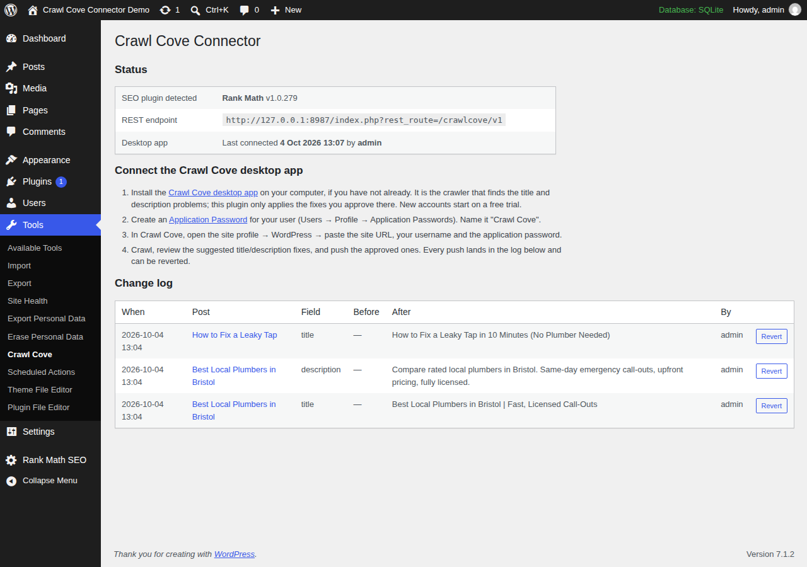

# Crawl Cove Connector — WordPress SEO Plugin for Bulk Title & Meta Description Fixes

The official WordPress companion plugin for [Crawl Cove](https://crawlcove.com/?utm_source=wordpress-plugin&utm_medium=referral&utm_campaign=github-readme), the desktop SEO crawler. Push approved page title and meta description fixes from your SEO audit straight into **Yoast SEO**, **Rank Math**, **SEOPress** or **All in One SEO (AIOSEO)**, with a full change log and one-click revert.

Crawl your site, review the suggested fixes in the app, push the ones you approve. No CSV exports, no spreadsheets, no copy-pasting into the post editor one page at a time.



## Why this plugin exists

Every SEO crawler can find missing, duplicate, too-long or too-short titles and meta descriptions. Almost none of them can fix any of it. The usual workflow is: export a CSV, open each post in the WordPress editor, find the SEO plugin's meta box, paste, save, repeat a few hundred times.

Crawl Cove Connector closes that loop. The [Crawl Cove desktop crawler](https://crawlcove.com) sends the fixes you approved to your site over the WordPress REST API, and this plugin writes them into the native fields of whichever SEO plugin you already use. Nothing is duplicated or overridden at render time; your SEO plugin keeps working exactly as before, just with better values.

The plugin is free. The Crawl Cove desktop app it works with is a paid crawler that starts with a free trial, no card needed: see [Crawl Cove pricing](https://crawlcove.com/pricing?utm_source=wordpress-plugin&utm_medium=referral&utm_campaign=github-readme).

## Features

- **Bulk-apply title and meta description fixes** approved in the Crawl Cove app, in batches, with per-item results.
- **Works with the four major WordPress SEO plugins**: Yoast SEO, Rank Math, SEOPress and AIOSEO. The connector detects which one is active and writes its native fields.
- **Full change log with one-click revert**: every write records the previous value. Undo any change from **Tools → Crawl Cove** or from the app. The log keeps the most recent 1,000 entries (a title and a description on one post are two); once it is full, each new push drops the oldest entries, already-reverted ones first, and the Tools page says so.
- **Dry-run mode** shows exactly what would change before anything is written.
- **Authentication via WordPress core Application Passwords**: no extra accounts, no API keys stored by the plugin, revoke access any time from your user profile.
- **Respects WordPress permissions**: a connected user can only change posts they are allowed to edit (`edit_post` checked per post).
- **Private by design**: no external requests, no tracking, no data leaves your site. The plugin only receives what you send it.
- **Small and auditable**: plain GPL PHP with no framework or dependencies, unit- and integration-tested, PHPCS-clean against WordPress-Extra and WordPress-Docs.

## How it works

The plugin registers a REST API under `crawlcove/v1` (auth: WordPress core Application Passwords):

| Route | Method | Purpose |
|---|---|---|
| `/status` | GET | Plugin + detected SEO plugin info |
| `/resolve` | POST | Map crawled URLs to posts, return current title/description |
| `/apply` | POST | Apply a batch of reviewed fixes (`dry_run` supported) |
| `/changes` | GET | The change log |
| `/revert` | POST | Restore a change's previous value |

Safety model:

- Nothing is written that wasn't sent by an authenticated user with the right capability for that specific target: `edit_post` for a post/page, `manage_options` for the homepage, `edit_term` for a taxonomy term.
- Values are sanitized and length-capped; batches are capped at 50 changes.
- Every write records the previous value; revert from the app or from **Tools → Crawl Cove**.
- Empty string means "remove the override, fall back to the SEO plugin's template".
- No external requests, no tracking, no data leaves the site.

### The homepage target (`post_id: 0`)

A site with no static front page set (Settings → Reading → **"Your latest posts"**)
has no post to hold a title/description override for `/` — Yoast and Rank Math each
keep it in their own settings instead. `/resolve` reports the site root as
`post_id: 0` in that case (a static front page still resolves to its own real
post id, exactly like any other page — nothing changes there); pass `post_id: 0`
back to `/apply` or `/revert` to target it.

- **Supported adapters**: Yoast SEO, Rank Math and SEOPress. AIOSEO changes to
  `post_id: 0` fail with `ccc_home_unsupported` — the change is reported, not
  silently dropped. AIOSEO isn't just unresearched: its "homepage" title and
  description read the *same* site-wide template used to fill in every other
  page's title/description, so writing to it to "fix the homepage" would
  silently change titles across the whole site, not just `/`.
- **Capability**: `manage_options`, not `edit_post` — there is no post to check
  `edit_post` against, and Settings → Reading (where this value lives natively)
  already requires it.
- **Rank Math's homepage title cannot be cleared**: unlike every other
  title/description field in this plugin, an empty string sent for Rank Math's
  homepage title is rejected with `ccc_home_title_clear_unsupported` instead of
  being written. Verified against real Rank Math source: its homepage title has
  no fallback template applied at render time (an empty stored value renders as
  a literally empty `<title>` tag), unlike Yoast's homepage title/description and
  Rank Math's own homepage description, which do fall back safely. Set a new
  title instead of clearing it, or clear it from Rank Math's own settings page.
- Sending `post_id: 0` on a site that **does** have a static front page returns
  `ccc_no_homepage_target` — pass that page's own post id instead.
- On a Polylang site, `post_id: 0` can also carry an optional `lang` field
  to target a non-default language's own homepage — see
  [Multilingual sites](#multilingual-sites-polylang-wpml-etc) below.

### The taxonomy term target (a negative `post_id`)

A category, tag or custom-taxonomy archive (e.g. `/category/news/`) has no
post to hold a title/description override — Yoast, Rank Math and SEOPress
each keep per-term SEO data in their own storage instead. `/resolve` reports
a term archive URL as `post_id: -$term_id` (term ids are always positive, so
a negative number is unambiguous and free to repurpose — the same trick
`post_id: 0` already uses for the homepage); pass that same negative number
back to `/apply` or `/revert` to target it.

This is deliberately a **per-term** override, not the taxonomy's site-wide
default title *template* (Settings the SEO plugin itself exposes, e.g.
"Category archives" in Yoast's Search Appearance). A template change would
affect every term in that taxonomy at once — wrong for a fix aimed at one
crawled URL — so this plugin never touches it.

- **Supported adapters**: Yoast SEO, Rank Math and SEOPress. AIOSEO changes
  to a term fail with `ccc_term_unsupported` — the change is reported, not
  silently dropped. AIOSEO isn't just unresearched: its own source confirms
  per-term SEO fields are a Pro-only feature (`app/Common/Main/
  BulkActions.php`: "Pro only. The term analysis columns live on the Pro
  aioseo_terms table") — nothing exists to write to in the free plugin this
  connector supports.
- **Capability**: `edit_term`, WordPress core's own meta capability for
  editing a specific term — there is no post to check `edit_post` against.
  It maps through to the term's taxonomy (e.g. `manage_categories` for
  `category`/`post_tag`; a custom taxonomy can register its own capability
  type). Editor-role users have this by default; Author-role users do not.
- Sending a negative `post_id` with no matching term returns `ccc_no_term`.
- Unlike Rank Math's homepage title, clearing a term's title or description
  to `''` is safe for all three supported adapters — each falls back to the
  taxonomy's own default title template, verified against real source
  (Rank Math's `Paper\Taxonomy::title()`; Yoast's term-archive indexable
  presentation follows the same pattern as its homepage description;
  SEOPress's `TaxonomySpecification::getValue()` falls through to its own
  per-taxonomy default the same way).

See [SECURITY-NOTES.md](SECURITY-NOTES.md) for the full security pass (capability matrix, fuzzing, findings).

### WooCommerce products and categories

Nothing in this plugin special-cases a post type or taxonomy, so WooCommerce
products (`post_type: product`) and product categories (the `product_cat`
taxonomy, via the negative-`post_id` term target above) already work exactly
like any other post/page or category — verified against a real WooCommerce
install, not assumed from its being "just" a custom post type.

One real difference from ordinary posts: **WooCommerce only grants product
edit capabilities (`edit_products`, `edit_product_terms`, etc.) to the Shop
Manager and Administrator roles, not Editor** (confirmed against
WooCommerce's own `WC_Install::create_roles()` source). An Editor-role user
who can push fixes to ordinary posts/pages will get `ccc_forbidden` on
WooCommerce products/categories — connect as a Shop Manager or Administrator
if you want those pushed too. This is WooCommerce's own capability model,
not a plugin limitation.

### Multilingual sites (Polylang, WPML, etc.)

Ordinary translated content works with zero special handling — a post's
translation is its own real post, with its own `post_id` and its own SEO
postmeta, so it resolves, applies and reverts exactly like any other post.
The same is true for a translated category/tag term (each language's term
is its own real `term_id`, so it already gets its own SEO title/description
via the negative-`post_id` target above).

**The "your latest posts" homepage is the one target with no post or term
of its own to hold a per-language value**, so it needs a small REST
contract addition: an optional `lang` field, sent alongside `post_id: 0`.

- `/resolve` reports a non-default language's homepage URL (for example
  `/fr/` under Polylang's directory URL mode) as `post_id: 0` with
  `lang: "fr"` — the default language's own homepage still reports
  `lang: ""`, exactly as before this field existed. (An earlier version
  either misresolved `/fr/` to the wrong internal target, or — after that
  was fixed — reported it as `ccc_unresolvable`; both are now `post_id: 0`,
  see the changelog.) A static front page in another language is
  unaffected either way, since that's just an ordinary page with its own
  `post_id`.
- To push a fix, send that same `lang` back: `{"post_id": 0, "lang": "fr",
  "title": "..."}` on `/apply`/`/revert`. Omitting `lang` (or sending your
  site's own default language code) targets the plain/default-language
  homepage exactly as it always has — this is fully additive, nothing
  about the existing `post_id: 0` contract changed.
- **Supported adapters: Yoast SEO only.** Verified against Polylang's own
  source: it ships a dedicated compatibility module *only* for Yoast
  (`integrations/wpseo/`, registering `title-home-wpseo`/
  `metadesc-home-wpseo` with Polylang's own string-translation system) —
  there is no such module for Rank Math, SEOPress or AIOSEO, because none
  of them has a per-language slot to put a value into: their homepage
  title/description is one value shared across every language, full stop.
  Sending `lang` to any of those three returns `ccc_language_unsupported`
  — reported, not silently written as a site-wide change nobody asked for.
- `lang` on any target other than `post_id: 0` returns
  `ccc_language_requires_home`. A `lang` that isn't one of the site's
  active Polylang language codes returns `ccc_no_such_language`; `lang`
  sent with no supported multilingual plugin active returns
  `ccc_multilingual_required`.
- Pushing a fix to the **default**-language homepage target (`lang`
  omitted) only ever affects your default language's title — verified
  against a real install that this does not corrupt or overwrite a
  non-default language's already-translated homepage title (Polylang's
  own string-translation system reattaches it to the new original string,
  the same mechanism `lang`-qualified writes use directly).

**TranslatePress is architecturally different from Polylang/WPML, and needs
no `lang` field at all.** It has no separate post or SEO storage per
language — it translates the SAME post's SAME Yoast/Rank Math/SEOPress/
AIOSEO postmeta at render time, by swapping the rendered *string* (its own
gettext-style dictionary, keyed on the literal original text). There is
nothing per-language for `lang` to mean here, so it's simply never sent or
returned for a TranslatePress site.

- A URL under TranslatePress's language prefix (e.g. `/fr/some-post/`, or
  the `/fr/` homepage) resolves to the exact same target — the same
  `post_id`, or `HOME_ID` — as its default-language counterpart, verified
  end-to-end against a real install. Confirmed against TranslatePress's own
  source that this is safe rather than assumed: it manages the language
  prefix with plain string manipulation (`includes/class-url-converter.php`),
  not a WordPress rewrite rule — there is no `add_rewrite_rule()` call
  anywhere in the plugin — so there is no Polylang-style risk of colliding
  with a real (or internal) taxonomy's own rewrite rule.
- Before this was handled, EVERY URL under a non-default language's prefix
  was `ccc_unresolvable` — not a homepage-only gap, every translated post,
  page, and term archive on the whole site. See the 0.10.0 changelog entry.
- One consequence of TranslatePress's design, not a CCC bug: because its
  translation lookup is keyed on the literal original string, any edit to
  that string — from this plugin, or from a site owner's own hand-edit in
  the SEO plugin's metabox, no difference — orphans whatever translation
  already existed for the old string until a human re-translates it in
  TranslatePress's own editor.

### The change log

Every write `/apply` makes is recorded with its previous value, one entry per
field (a title and a description on the same post are two entries), and
`/changes` returns the log newest first. The log is a single non-autoloaded
option capped at **1,000 entries**. When a new entry would take it past the
cap, already-reverted entries are dropped first (oldest first) and only then
the oldest live ones, so the entries that can still undo something survive
longest. `/revert` with an id that has been dropped returns `ccc_not_found`
(HTTP 404), the same as an id that never existed; the app should treat that
as "no longer revertable from here", not as a transport error. The Tools page
shows 100 rows a page and says so when the log is full.

### The connection status

Tools → Crawl Cove has a "Desktop app" row: "Not connected yet" until an
authenticated user (one that passes the shared `edit_posts` check) calls any
`crawlcove/v1` route, then "Last connected <date> by <user>". It is written
from the routes' permission callback, so anonymous, wrong-password and
under-privileged requests never move it. One small non-autoloaded option
(`ccc_last_connection`: time, user, route), written at most once a minute per
user and deleted on uninstall. No REST contract change; the app needs to do
nothing, and a successful `GET /status` is enough to flip it.

### Caching plugins

Every applied or reverted change tells WordPress (and, in turn, most page
caching plugins) that the affected page is stale:

- **An ordinary post or page**: re-saved via `wp_update_post()`, which fires
  core's `clean_post_cache` action — the hook WP Super Cache, W3 Total
  Cache and similar plugins use to purge that page's cached HTML.
- **The homepage (`post_id: 0`) or a taxonomy archive**: neither has a post
  row for `clean_post_cache` to fire against, so instead this plugin runs a
  best-effort full-site cache purge — calling WP Super Cache's, W3 Total
  Cache's or WP Rocket's own public purge function if that plugin is
  active, and firing WP Fastest Cache's and LiteSpeed Cache's own
  documented `wpfc_clear_all_cache`/`litespeed_purge_all` action hooks.

For anything else, hook the plugin-agnostic `ccc_after_uncached_write`
action (fires after every homepage/taxonomy write) or filter
`ccc_clear_full_cache_after_write`/`ccc_touch_post_after_apply` (both
default `true`; return `false` to opt out of the automatic purge/re-save
entirely).

## Installation

1. Download **[crawl-cove-connector.zip](https://github.com/CrawlCove/wordpress-seo-connector/releases/latest/download/crawl-cove-connector.zip)** from the [latest GitHub release](https://github.com/CrawlCove/wordpress-seo-connector/releases/latest). In your WordPress admin go to **Plugins → Add New → Upload Plugin**, choose the zip and activate it (requires WordPress 6.2+ and PHP 7.4+). Don't use GitHub's "Download ZIP" of the source tree: it unpacks under the wrong folder name and includes the test suite. The wordpress.org listing is pending; once it is live you will be able to install from **Plugins → Add New** by searching "Crawl Cove Connector".
2. Create an Application Password: **Users → Profile → Application Passwords → "Crawl Cove"**.
3. In the [Crawl Cove desktop app](https://crawlcove.com/download?utm_source=wordpress-plugin&utm_medium=referral&utm_campaign=github-readme), open your site profile → WordPress and enter the site URL, username and application password.
4. Crawl, review the suggested fixes, push the approved ones. Review or revert them any time under **Tools → Crawl Cove**.

## Frequently asked questions

**Does it work without the Crawl Cove app?**
The plugin is the receiving end; fixes are reviewed and sent from the desktop crawler. The change log and revert work standalone in wp-admin.

**Will it conflict with my SEO plugin?**
No. It writes the same post meta fields your SEO plugin owns (for example Yoast's `_yoast_wpseo_title`), then gets out of the way. There is nothing to keep in sync.

**Can it change content or anything besides SEO fields?**
No. It writes SEO titles and meta descriptions, nothing else, and only for posts the authenticated user can edit.

**What happens to the change log if I delete the plugin?**
Deleting the plugin (Plugins → Delete) removes everything it stored, including the change log, so the revert history goes with it. The titles and descriptions it applied stay in your SEO plugin as they are. Deactivating the plugin keeps the log.

## Development

```
composer install
composer test     # PHPUnit against lightweight WP stubs (tests/bootstrap.php)
composer lint     # php -l over all plugin files
```

The core logic (`CCC_Service`, `CCC_Adapter`, `CCC_Change_Log`) is deliberately free of `WP_REST_*` types so it unit-tests without a WordPress install. Integration smoke-testing against a real WordPress (all four adapters, plus a security check suite) runs before each release: see `tests/integration/`.

## Releasing

Versions are tagged `vX.Y.Z` on `main`. See [CHANGELOG.md](CHANGELOG.md).

## About Crawl Cove

[Crawl Cove](https://crawlcove.com) is a desktop SEO crawler for auditing sites of any size: broken links, redirects, duplicate content, titles and meta descriptions, structured data and more, with your data staying on your machine.

License: [GPLv2 or later](LICENSE).
